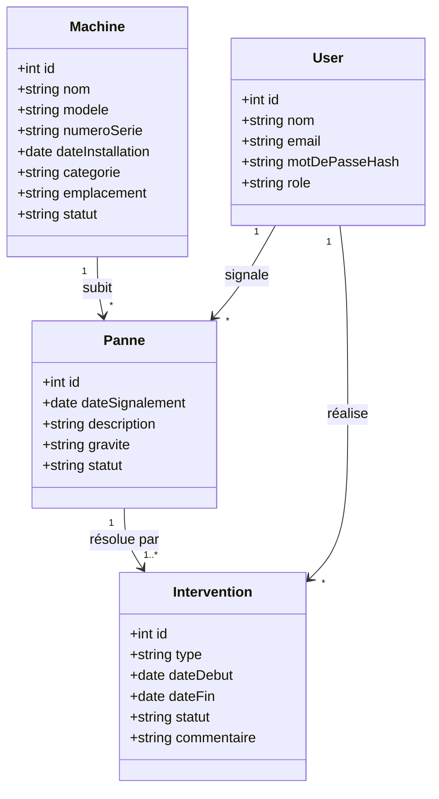

# Diagramme de classes

> Brouillon initial — hypothèse de modèle, à valider en réunion
> (notamment la relation Panne ↔ Intervention).

## Notes / hypothèses à confirmer

- Une panne peut-elle avoir plusieurs interventions (ex. intervention
  partielle puis complémentaire) ou est-ce toujours 1↔1 ?
- Le champ `statut` de `Machine` doit-il être dérivé automatiquement du
  statut des pannes/interventions en cours, ou géré manuellement ?
- Faut-il une entité `Atelier`/`Site` séparée si plusieurs emplacements physiques ?
