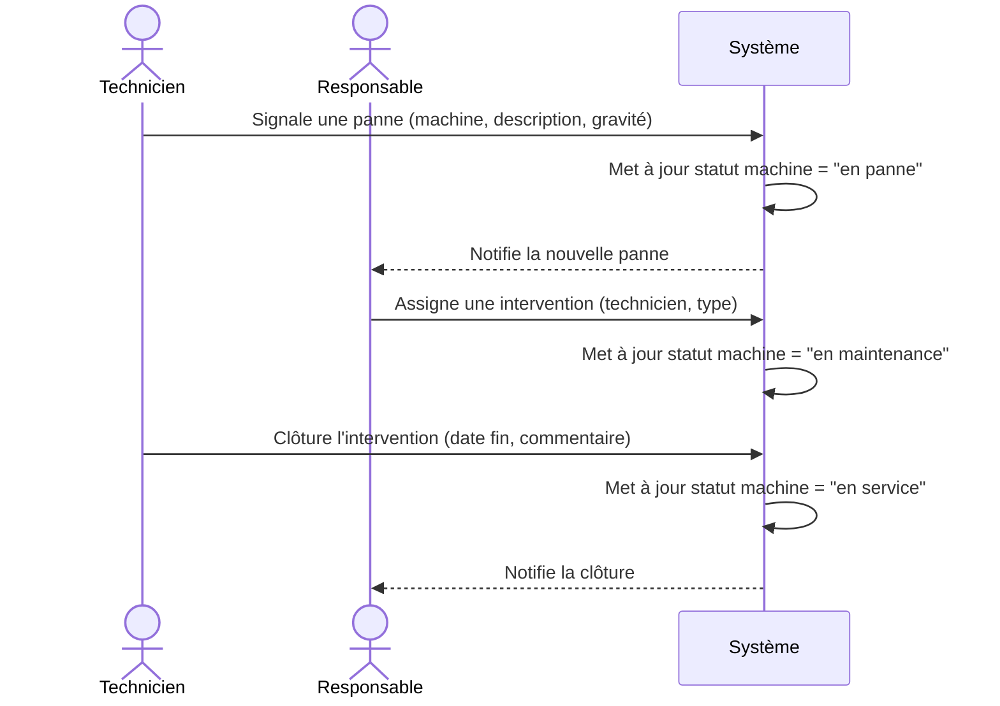

# Diagramme de séquence — Signalement et résolution d'une panne

> Flux clé à valider ; sert à détecter les cas limites (ex. statut machine
> pendant une intervention en cours).

## Cas limites à clarifier

- Que se passe-t-il si une machine a plusieurs pannes ouvertes simultanément ?
- Le responsable peut-il refuser/réassigner une intervention ?
- Y a-t-il une validation finale du responsable avant clôture définitive ?
