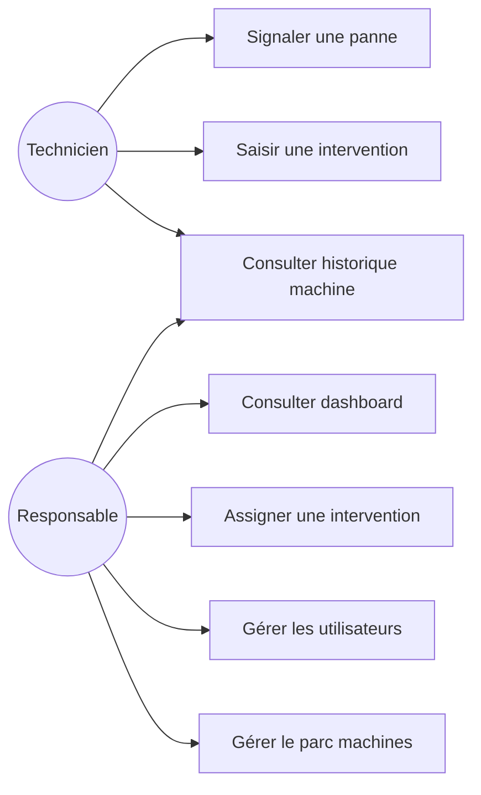

# Diagramme de cas d'utilisation

> Brouillon initial — à valider après la réunion de cadrage.

## Notes

- Confirmer si le technicien peut aussi créer/modifier une fiche machine
  ou si c'est réservé au responsable.
- Confirmer l'existence d'un rôle admin distinct.
